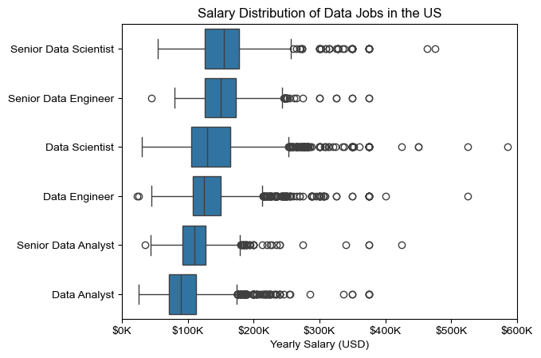

# Overview

Welcome to my analysis of the data job market, focusing on data analyst roles from the year 2023. This project was created out of a desire to navigate and understand the job market more effectively. It delves into the top-paying and in-demand skills to help find optimal job opportunities for data analysts. 


The data sourced from Luke Barousse's Python Course which provides a foundation for my analysis, containing detailed information on job titles, salaries, locations, and essential skills. Through a series of Python scripts, I explore key questions such as the most demanded skills, salary trends, and the intersection of demand and salary in data analytics.


# The Questions

Here are the questions I want answer and explore in this project:


1. What are the skills most in demand for the top 3 most popular data roles?
2. How are in-demand skills trending for Data Analysts?
3. How well do jobs and skills pay for Data Analysts?
4. What are the optimal skills for data analysts to learn? (High Demand AND High Paying)


# Tools I Used

To answer the questions above I used a ton of several key tools:

* Python: The backbone of my analysis, allowing me to analyze the data and find critical insights.I also used the following Python libraries:
    * Pandas Library: This was used to analyze the data.
    * Matplotlib Library: I visualized the data.
    * Seaborn Library: Helped me create more advanced visuals.
* Jupyter Notebooks: The tool I used to run my Python scripts which let me easily include my notes and analysis. 
* Visual Studio Code: What I used to run Python and Jupyter Notebooks.
* Git & GitHub: Essential for version control and sharing my Python code and analysis, ensuring collaboration and project tracking.


# Data Prep and Cleaning

This section shows what I did to prep and clean the data before I started to answer every question.


## Import and Clean Up Data

I started each section by importing all packages I would use, loading the data, and then some minor clean up to ensure the data is ready to be used.


```python
# Importing Libraries
import ast
import pandas as pd
import seaborn as sns
from datasets import load_dataset
import matplotlib.pyplot as plt  

# Loading Data
dataset = load_dataset('lukebarousse/data_jobs')
df = dataset['train'].to_pandas()

# Data Cleanup
df['job_posted_date'] = pd.to_datetime(df['job_posted_date'])
df['job_skills'] = df['job_skills'].apply(lambda x: ast.literal_eval(x) if pd.notna(x) else x)
```

## Filter US Jobs

In my analysis I wanted to focus on US jobs only since this is where I live. So I applied a filter to narrow it down to just jobs in the United States.


```python
df_US = df[df['job_country'] == 'United States']
```


# The Analysis 

I have seperated a Jupyter Notebook for each question. Below is the analysis and insights that I saw from the data. Each question will have a link to the Jupyter notebook with the code in full:

## 1. What are the most demanded skills for the top 3 most popular data roles?

To find the most demanded skills for the top 3 popular data roles I filtered the top 3 roles and then got the top 5 skills for these roles. This query highlights what skills top roles in the data field are interested in, and what aspiring data people should be learning to better prepare for these roles. 

View my notebook with detailed steps here: [2_Skill_Demand.ipynb](Data_Project_Analysis/2_Skill_Demand.ipynb)


### Visualize Data 

```python
fig, ax = plt.subplots(len(job_titles), 1)

sns.set_theme(style= 'ticks')

for i , job_title in enumerate(job_titles):
    df_plot = df_job_skills_perc[df_job_skills_perc['job_title_short'] == job_title].head(5)
    sns.barplot(data = df_plot, x = 'skill_percent', y = 'job_skills', ax= ax[i], hue = 'skill_count', palette= 'dark:g_r')
    ax[i].set_title(job_title)
    ax[i].set_xlabel("")
    ax[i].set_ylabel("")
    ax[i].set_xlim(0, 79)
    ax[i].legend().set_visible(False)

    for n, v in enumerate(df_plot['skill_percent']):
        ax[i].text(v +1 , n , f'{v:.0f}%' , va = 'center')
    if i != len(job_titles) -1:
        ax[i].set_xticks([])

fig.suptitle('Likelihood of Skills Requested in US Job Posting', fontsize= 15)
fig.tight_layout(h_pad=0.5)
plt.show()

```


### Results


### Insights

- SQL is a very important tool with it being the most requested skill in both Data Analyst and Data Engineering roles, and it coming in second for Data Scientist with over half of the job posting requesting it.
- Python is highly demanded across all jobs, but more prominent for Data Scientists (72%) and Data Engineers (65%).
- From the top requested skills we can see Data Scientist heavily focuses on more statistical view using skills like Python, R, and SAS, while the Data Engineer uses more specialized tools like AWS, Azure, and Spark.


## 2. How are in-demand skills trending for Data Analysts?

In this section I want to see what are the trends of the top skills for Data Analysts to see if any of these skills are falling out of use. To do this I filtered the data to the top 5 skills for Data Analysts. I then calculated the trend among all the months in the year using percents.

The full analysis of how I manipulated the data step by step is here: [3_Skills_Trend.ipynb](Data_Project_Analysis/3_Skills_Trend.ipynb)

### Visualize Data 

```python
df_plot_DA_US_percent = df_DA_US_percent.iloc[:, :5]

sns.lineplot(data = df_plot_DA_US_percent, dashes = False, palette = 'tab10')
sns.set_theme(style = 'ticks')
sns.despine()
plt.title('Top Trending Skills for Data Analysts in the US')
plt.xlabel('2023')
plt.ylabel('Percent Liklihood in Job Posting')
plt.legend().remove()

#Add percent sign to y axis
from matplotlib.ticker import PercentFormatter
ax = plt.gca()
ax.yaxis.set_major_formatter(PercentFormatter(decimals = 0))

#Add text onto the graph
for i in range(5):
    plt.text(11.2, df_plot_DA_US_percent.iloc[-4, i], df_plot_DA_US_percent.columns[i])

```


### Results 


### Insights

- SQL is the highest demanded job throughout the whole year, although it does slowly decline through the year. This skill is still highly worth learning due to about half of the jobs for Data Analysts request it in a job listing.
- All of the skills besides SQL ended about where they started at the beggining of the year. This shows that these skills are not on a downward trend, and all of these skills are still worth learning.
- Python and Excel seem to be on a big upwards trend, and we could see a big increase in jobs asking for those skills in data in future years.


## 3. How well do jobs and skills pay for Data Analysts?

To identify the highest-paying roles and skills, I only got jobs in the United States and looked at their median salary. But first I looked at the salary distributions of common data jobs like Data Scientist, Data Engineer, and Data Analyst, to get an idea of which jobs are paid the most.

View my detailed steps here: [4_Salary_Analysis.ipynb](Data_Project_Analysis/4_Salary_Analysis.ipynb)


### Visualize Data

```python
sns.boxplot(data = df_US_top6, x='salary_year_avg', y='job_title_short',order = job_order)
sns.set_theme(style='ticks')

plt.title
plt.xlabel('Yearly Salary (USD)')
plt.ylabel('')
plt.xlim(0, 600000)

#Makes it read 100k instead of 100000
ticks_x = plt.FuncFormatter(lambda y , pos: f'${int(y/1000)}K')
plt.gca().xaxis.set_major_formatter(ticks_x)
plt.show()

```

### Results 



### Insights

- From this I see that Data Analysts get paid the least out of the top 6 data roles. To extend that, even the Senior Data Analyst gets paid less than the entry role for Data Scientist and Data Engineer. This makes sense due to our previous analysis where Data Analysts generally needed the least amount of skills to start. From this insight, Data Analysts could consider not promoting to Senior Data Analysts, but learn more skills to earn a entry level position on one of the other data roles. 
- We see a lot of outliers for the Data Science and Data Engineer roles. This shows that some jobs in these roels will pay more depending on how your skills and experience are. 


## Highest Paid & Most Demanded Skills for Data Analysts

In this section I build on the last graph, but focus on Data Analysts. I am interested in what are the most in demand skills and which skills pay the most. 


### Visualize Data
```python
fig, ax = plt.subplots(2, 1)  

# Top 10 Highest Paid Skills for Data Analysts
sns.barplot(data=df_DA_top_pay, x='median', y=df_DA_top_pay.index, hue='median', ax=ax[0], palette='dark:g_r')
ax[0].legend().remove()
ax[0].set_title('Highest Paid Skills for Data Analysts in the US')
ax[0].set_ylabel('')
ax[0].set_xlabel('')
ax[0].xaxis.set_major_formatter(plt.FuncFormatter(lambda x, _: f'${int(x/1000)}K'))


# Top 10 Most In-Demand Skills for Data Analysts')
sns.barplot(data=df_DA_top_skills, x='median', y=df_DA_top_skills.index, hue='median', ax=ax[1], palette='light:g')
ax[1].legend().remove()
ax[1].set_title('Most In-Demand Skills for Data Analysts in the US')
ax[1].set_ylabel('')
ax[1].set_xlabel('Median Salary (USD)')
ax[1].set_xlim(ax[0].get_xlim())  # Set the same x-axis limits as the first plot
ax[1].xaxis.set_major_formatter(plt.FuncFormatter(lambda x, _: f'${int(x/1000)}K'))

sns.set_theme(style='ticks')
plt.tight_layout()
plt.show()


```


### Results 


### Insights

- The highest paid skills are stuff like dplyr and bitbucket. These salaries seem very high, but when looking deeper at the data these skills had very little demand so the numbers are skewed. Some of these in the top 10 had less than 5 jobs asking for them. So these skills might be important, but are also more niche than other skills in the in-demand chart.
- Out of the most in-demand skills Python, R, and SAS pay more than other skills. This makes sense due to the fact that these are scrpiting languages and take more time to learn and are harder to use.
- SQL is 4th and 5th in terms of money, and is the most asked for skill. From our analysis so far, SQL should be the go to starter skill for those who want to do Data Analytics.


## 4. What is the most optimal skill to learn for Data Analysts 

To identify the most optimal skills to learn ( the ones that are the highest paid and highest in demand) I calculated the percent of skill demand and the median salary of these skills. To easily identify which are the most optimal skills to learn.


To view all steps here click here: [5_Optimal_Skills.ipynb](Data_Project_Analysis/5_Optimal_Skills.ipynb)


### Code Snippet of Visualization 

```python
from adjustText import adjust_text
import matplotlib.pyplot as plt

plt.scatter(df_DA_skills_high_demand['skill_percent'], df_DA_skills_high_demand['median_salary'])
plt.show()
  ```


### Results


### Insights 

* Python seems to have the highest median salary out of all the skills, and is the third most sought after skill. This shows it is important to learn a scripting language.
* SQL, yet again, is landing among the top as the most important skills for Data Analysts. It is the most asked for skill and ranks well in the median salary range.
* Tableau and Excel are also contenders to learn. Just based on this graph alone we can establish a learning order for Data Analysts: 
1. SQL - Through this analysis it has been the skill to learn. And this graph continues to show it.
2. Excel - This is easier to learn than scripting languages and is the second most looked for skill.
3. Python - This is the highest paid skill and you can accomplish a lot with it, making you a more powerful Analyst.
4. Tableau - This adds the final touches to your skills, but is not as needed as the other 3.


### Visualize Technologies

In this section I wanna take the last visualaztion and add a table that breaks up the points via technologies.


```python
sns.scatterplot(
    data=df_DA_skills_tech_high_demand,
    x='skill_percent',
    y='median_salary',
    hue='technology'
)

sns.despine()
sns.set_theme(style='ticks')

# Prepare texts for adjustText
texts = []
for i, txt in enumerate(df_DA_high_demand.index):
    texts.append(plt.text(df_DA_high_demand['skill_percent'].iloc[i], df_DA_high_demand['median_salary'].iloc[i], txt))

# Adjust text to avoid overlap
adjust_text(
    texts,
    arrowprops=dict(arrowstyle='->', color='gray'),
    force_text=10,  # Lower force between texts
    force_points=0.2  # Lower force between text and points
)

# Set axis labels, title, and legend
plt.xlabel('Percent of Data Analyst Jobs')
plt.ylabel('Median Yearly Salary')
plt.title('Most Optimal Skills for Data Analysts in the US')
plt.legend(title='Technology')

from matplotlib.ticker import PercentFormatter
ax = plt.gca()
ax.yaxis.set_major_formatter(plt.FuncFormatter(lambda y, pos: f'${int(y/1000)}K'))
ax.xaxis.set_major_formatter(PercentFormatter(decimals=0))

# Adjust layout and display plot 
plt.tight_layout()
plt.show()
```


### Results


### Insights
* The scatter plot shows that most of the programming skills (colored blue) tend to cluster at higher salary levels compared to other categories, indicating that programming expertise might offer greater salary benefits within the data analytics field.

* The database skills and cloud skills (colored green and red), such as Oracle and SQL Server, are associated with some of the highest salaries among data analyst tools. This indicates a significant demand and valuation for data management and manipulation expertise in the industry.

* Analyst tools (colored orange), including Tableau and Power BI, are prevalent in job postings and offer competitive salaries, showing that visualization and data analysis software are crucial for current data roles. This category not only has good salaries but is also versatile across different types of data tasks.


# What I Learned

Throughout this project, I deepened my understanding of the data analyst job market and enhanced my technical skills in Python, especially in data manipulation and visualization. Here are a few specific things I learned:

* Advanced Python Usage: Utilizing libraries such as Pandas for data manipulation, Seaborn and Matplotlib for data visualization, and other libraries helped me perform complex data analysis tasks more efficiently.
* Data Cleaning Importance: I learned that thorough data cleaning and preparation are crucial before any analysis can be conducted, ensuring the accuracy of insights derived from the data.
* Strategic Skill Analysis: The project emphasized the importance of aligning one's skills with market demand. Understanding the relationship between skill demand, salary, and job availability allows for more strategic career planning in the tech industry.


# Insights
This project provided several general insights into the data job market for analysts:

* Skill Demand and Salary Correlation: There is a clear correlation between the demand for specific skills and the salaries these skills command. Advanced and specialized skills like Python and Oracle often lead to higher salaries.
* Market Trends: There are changing trends in skill demand, highlighting the dynamic nature of the data job market. Keeping up with these trends is essential for career growth in data analytics.
* Economic Value of Skills: Understanding which skills are both in-demand and well-compensated can guide data analysts in prioritizing learning to maximize their economic returns.


# Challenges I Faced

This project was not without its challenges, but it provided good learning opportunities:

* Data Inconsistencies: Handling missing or inconsistent data entries requires careful consideration and thorough data-cleaning techniques to ensure the integrity of the analysis.
* Complex Data Visualization: Designing effective visual representations of complex datasets was challenging but critical for conveying insights clearly and compellingly.
* Balancing Breadth and Depth: Deciding how deeply to dive into each analysis while maintaining a broad overview of the data landscape required constant balancing to ensure comprehensive coverage without getting lost in details.


# Conclusion

This exploration into the data analyst job market has been incredibly informative, highlighting the critical skills and trends that shape this evolving field. The insights I got enhance my understanding and provide actionable guidance for anyone looking to advance their career in data analytics. As the market continues to change, ongoing analysis will be essential to stay ahead in data analytics. This project is a good foundation for future explorations and underscores the importance of continuous learning and adaptation in the data field.
